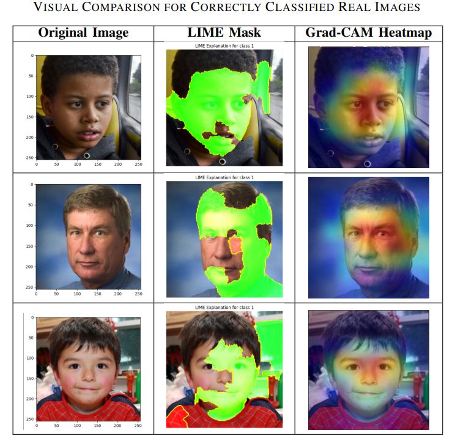
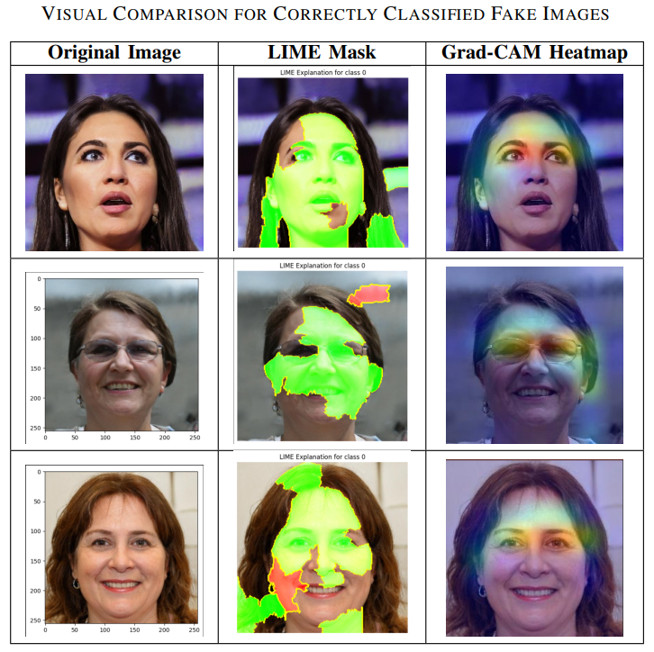

# Enhancing Deepfake Detection with Explainable AI

## 📌 Overview

This project implements a **DenseNet-121 based Deepfake Detection Framework** augmented with **Explainable AI (XAI)** techniques — **LIME** and **Grad-CAM** — to detect and explain GAN-generated facial forgeries.
It achieves **99.69% accuracy** on the **140k Real-vs-Fake Faces** dataset, providing both **high detection performance** and **human-understandable visual explanations** for forensic reliability.

---

## ✨ Key Features

* **High Accuracy Detection**: DenseNet-121 backbone fine-tuned for deepfake classification.
* **Dual Explainability**:

  * **LIME**: Superpixel-level, model-agnostic explanations.
  * **Grad-CAM**: Region-level, class-discriminative heatmaps.
* **Complementary Insights**: Pixel-level and region-level interpretability combined.
* **Robust Training**: Extensive data augmentation for better generalization.
* **Benchmark Superiority**: Outperforms MesoNet, FaceForensics++, and artifact-based methods.

---

## 📂 Dataset

* **Name**: [140k Real-vs-Fake Faces](https://www.kaggle.com/datasets/xhlulu/140k-real-and-fake-faces)
* **Size**: 70,000 real + 70,000 fake images.
* **Preprocessing**:

  * Resize to **256×256**.
  * Normalize pixel values to `[0,1]`.
  * Data augmentation: random horizontal flips and ±15° rotations.

---

## 🏗 Methodology

1. **Data Preparation**

   * Load, split (train/val/test), and augment dataset.
2. **Model Architecture**

   * DenseNet-121 with custom head:

     * Global Average Pooling
     * Fully Connected (512 units, ReLU, BatchNorm, Dropout 30%)
     * Sigmoid output for binary classification.
3. **Training**

   * Optimizer: Adam (lr = 1e-3)
   * Loss: Binary Crossentropy
   * Early stopping & checkpointing.
4. **Explainability**

   * **LIME** for superpixel-based explanations.
   * **Grad-CAM** for heatmaps over key facial regions.

---

## 📊 Results

### **Quantitative Performance**

| Method                      | Accuracy   |
| --------------------------- | ---------- |
| MesoNet                     | 98.00%     |
| FaceForensics++             | 96.36%     |
| Face Warping Artifacts      | 97.50%     |
| **Proposed (DenseNet-121)** | **99.69%** |

* Precision: **99.60%**
* Recall: **99.77%**
* F1-Score: **99.68%**

### **Qualitative Insights**

* **Real Images**:
    
  * LIME: Highlights skin textures & natural lighting.
  * Grad-CAM: Focuses on stable landmarks (eyes, nose, mouth).

* **Fake Images**:
    
  * LIME: Isolates blending & boundary artifacts.
  * Grad-CAM: Highlights artifact-prone contours around eyes & mouth.

---

## ⚙️ Installation & Usage

### 1️⃣ Clone Repository

```bash
git clone https://github.com/SahilKarne/Enhancing-Deepfake-Detection-with-Explainable-AI.git
cd Enhancing-Deepfake-Detection-with-Explainable-AI
```

### 2️⃣ Install Requirements

```bash
pip install -r requirements.txt
```

### 3️⃣ Run the Notebook

Open `Enhancing-Deepfake-Detection-with-XAI.ipynb` in Jupyter/Colab and run all cells.
Make sure to download and extract the dataset into the specified directory in the notebook.

---

## 📌 Project Structure

```
├── Enhancing-Deepfake-Detection-with-XAI.ipynb    # Main implementation
├── requirements.txt                               # Python dependencies
├── model_cp.weights.hs                            # Pre-trained model weights
├── assets/                                        # Images for README
└── README.md                                      # Project documentation

```

---

## 📧 Contact

* **Author**: Sahil Karne
* **Email**: [sahilkarne99@gmail.com](mailto:sahilkarne99@gmail.com)

---
